# 🗄️ Multitrade Database - Entity Relationship Diagram

## 📊 Database Schema Overview

```mermaid
erDiagram
    %% User Management
    Admin {
        ObjectId _id PK
        string username UK
        string email UK
        string fullname
        string phone UK
        string password
        enum gender
        date dob
        string profileImage
        string permanentAddress
        string tempAddress
        string resOTP
        date OTP_Expires
        number tokenVersion
        enum status
        enum role
        date createdAt
        date updatedAt
    }

    User {
        ObjectId _id PK
        string username UK
        string email UK
        string fullname
        string phone UK
        string password
        enum gender
        date dob
        string profileImage
        string permanentAddress
        string tempAddress
        string resOTP
        date OTP_Expires
        number tokenVersion
        enum status
        date createdAt
        date updatedAt
    }

    %% Product Categorization
    Category {
        ObjectId _id PK
        string name UK
        ObjectId admin FK
        date createdAt
        date updatedAt
    }

    SubCategory {
        ObjectId _id PK
        string name
        ObjectId category FK
        ObjectId admin FK
        date createdAt
        date updatedAt
    }

    Type {
        ObjectId _id PK
        string name
        ObjectId category FK
        ObjectId subCategory FK
        ObjectId admin FK
        date createdAt
        date updatedAt
    }

    Brand {
        ObjectId _id PK
        string name UK
        ObjectId admin FK
        date createdAt
        date updatedAt
    }

    %% Specifications
    SpecList {
        ObjectId _id PK
        string title
        string value
        enum status
        boolean displayInFilter
        ObjectId category FK
        ObjectId subCategory FK
        ObjectId type FK
        ObjectId brand FK
        ObjectId admin FK
        date createdAt
        date updatedAt
    }

    ProductSpecs {
        ObjectId _id PK
        ObjectId product FK
        ObjectId specList FK
        string value
        date createdAt
        date updatedAt
    }

    %% Products
    Product {
        ObjectId _id PK
        string slug UK
        string title
        string description
        string shortDescription
        array images
        string thumbnail
        number price
        ObjectId category FK
        ObjectId subCategory FK
        ObjectId type FK
        ObjectId brand FK
        array variants
        number rating
        number reviewCount
        number totalStock
        number minPrice
        number maxPrice
        enum status
        boolean featured
        boolean isDiscounted
        ObjectId admin FK
        string warranty
        string returnPolicy
        string shippingInfo
        array tags
        number totalSales
        number viewCount
        date createdAt
        date updatedAt
    }

    ProductVariant {
        ObjectId _id PK
        string sku UK
        string color
        string size
        string material
        number weight
        object dimensions
        array images
        number price
        number oldPrice
        number discountPrice
        number qty
        number thresholdQty
        enum status
        boolean shipping
        boolean isDefault
    }

    %% Reviews
    Review {
        ObjectId _id PK
        ObjectId product FK
        ObjectId user FK
        number rating
        string title
        string review
        boolean verified
        number helpful
        enum status
        date createdAt
        date updatedAt
    }

    %% Shopping
    Wishlist {
        ObjectId _id PK
        ObjectId user FK
        ObjectId product FK
        date createdAt
        date updatedAt
    }

    ShippingAddress {
        ObjectId _id PK
        string fullname
        string street
        string city
        string state
        string postalCode
        string country
        string phone
        string landmark
        ObjectId user FK
        date createdAt
        date updatedAt
    }

    Cart {
        ObjectId _id PK
        number qty
        string productType
        number productPrice
        number totalPrice
        ObjectId user FK
        ObjectId product FK
        date createdAt
        date updatedAt
    }

    %% Orders
    Order {
        ObjectId _id PK
        number totalPrice
        number totalItem
        number totalQty
        number discountAmt
        string couponApplied
        enum paymentMethod
        boolean paid
        enum status
        ObjectId shippingAddress FK
        ObjectId user FK
        date createdAt
        date updatedAt
    }

    CartOrder {
        ObjectId _id PK
        ObjectId order FK
        ObjectId cart FK
        date createdAt
        date updatedAt
    }

    OrderStatus {
        ObjectId _id PK
        string statusTitle
        enum status
        string message
        date dateTime
        ObjectId admin FK
        ObjectId order FK
        date createdAt
        date updatedAt
    }

    %% Inventory & Reporting
    InventoryLog {
        ObjectId _id PK
        ObjectId product FK
        string variantSku
        enum type
        number quantity
        number previousStock
        number newStock
        ObjectId orderId FK
        ObjectId admin FK
        string notes
        date createdAt
        date updatedAt
    }

    PriceLog {
        ObjectId _id PK
        ObjectId product FK
        string variantSku
        number oldPrice
        number newPrice
        date changedAt
    }

    Sale {
        ObjectId _id PK
        ObjectId orderId FK
        ObjectId product FK
        string variantSku
        number quantity
        number salePrice
        number totalLinePrice
        date soldAt
        date createdAt
        date updatedAt
    }

    %% Content Management
    HeroContent {
        ObjectId _id PK
        string title
        string image
        string link
        enum status
        ObjectId admin FK
        date createdAt
        date updatedAt
    }

    AdsPanel {
        ObjectId _id PK
        string title
        string image
        string locationId
        string link
        ObjectId admin FK
        date createdAt
        date updatedAt
    }

    CompanyInfo {
        ObjectId _id PK
        string title
        string description
        string email
        string phone
        string address
        string website
        object socialMedia
        string businessHours
        string logo
        enum status
        ObjectId admin FK
        date createdAt
        date updatedAt
    }

    %% Relationships
    Admin ||--o{ Category : creates
    Admin ||--o{ SubCategory : creates
    Admin ||--o{ Type : creates
    Admin ||--o{ Brand : creates
    Admin ||--o{ SpecList : creates
    Admin ||--o{ Product : creates
    Admin ||--o{ OrderStatus : creates
    Admin ||--o{ InventoryLog : creates
    Admin ||--o{ HeroContent : creates
    Admin ||--o{ AdsPanel : creates
    Admin ||--o{ CompanyInfo : creates

    Category ||--o{ SubCategory : contains
    Category ||--o{ Type : contains
    Category ||--o{ Product : categorizes
    Category ||--o{ SpecList : filters

    SubCategory ||--o{ Type : contains
    SubCategory ||--o{ Product : categorizes
    SubCategory ||--o{ SpecList : filters

    Type ||--o{ Product : categorizes
    Type ||--o{ SpecList : filters

    Brand ||--o{ Product : manufactures
    Brand ||--o{ SpecList : filters

    Product ||--o{ ProductSpecs : has
    Product ||--o{ Review : receives
    Product ||--o{ Wishlist : added_to
    Product ||--o{ Cart : added_to
    Product ||--o{ InventoryLog : tracked_in
    Product ||--o{ PriceLog : tracked_in
    Product ||--o{ Sale : sold_in
    Product ||--|{ ProductVariant : contains

    SpecList ||--o{ ProductSpecs : defines

    User ||--o{ Review : writes
    User ||--o{ Wishlist : owns
    User ||--o{ ShippingAddress : has
    User ||--o{ Cart : owns
    User ||--o{ Order : places

    Order ||--o{ CartOrder : contains
    Order ||--o{ OrderStatus : has
    Order ||--o{ InventoryLog : triggers
    Order ||--o{ Sale : generates
    Order ||--|| ShippingAddress : ships_to

    Cart ||--o{ CartOrder : part_of
```



## 🔗 Key Relationships

### **Core Business Flow:**
```
User → Cart → Order → Sale → InventoryLog
```

### **Product Hierarchy:**
```
Category → SubCategory → Type → Product → ProductVariant
```

### **Specification System:**
```
SpecList → ProductSpecs → Product (Advanced Search)
```

### **Order Management:**
```
Order → CartOrder → Cart → Product
Order → OrderStatus (Status History)
Order → Sale (Sales Tracking)
```

### **Inventory Tracking:**
```
Product → ProductVariant (Stock Management)
InventoryLog (Movement Tracking)
PriceLog (Price History)
```

## 📋 Model Categories

### **🔐 Authentication & Users**
- **Admin** - System administrators
- **User** - Customers

### **🏷️ Product Categorization**
- **Category** - Main product categories
- **SubCategory** - Product subcategories
- **Type** - Specific product types
- **Brand** - Product manufacturers

### **🔍 Specification System**
- **SpecList** - Available specifications (RAM, Storage, etc.)
- **ProductSpecs** - Product-specific specification values

### **🛍️ Products & Inventory**
- **Product** - Main product information
- **ProductVariant** - Embedded variants with inventory
- **Review** - Customer product reviews

### **🛒 Shopping Experience**
- **Wishlist** - Customer saved products
- **ShippingAddress** - Customer delivery addresses
- **Cart** - Shopping cart items

### **📦 Order Management**
- **Order** - Customer orders
- **CartOrder** - Junction table (Order ↔ Cart)
- **OrderStatus** - Order status history

### **📊 Reporting & Analytics**
- **InventoryLog** - Stock movement tracking
- **PriceLog** - Price change history
- **Sale** - Sales transaction records

### **🎨 Content Management**
- **HeroContent** - Homepage carousel
- **AdsPanel** - Advertisement management
- **CompanyInfo** - Company information

## 🔑 Key Design Patterns

### **1. Embedded Documents**
- **ProductVariant** embedded in **Product** for inventory management
- **SocialMedia** embedded in **CompanyInfo**
- **Dimensions** embedded in **ProductVariant**

### **2. Reference Relationships**
- **One-to-Many**: Admin → Products, User → Orders
- **Many-to-Many**: Product ↔ SpecList (via ProductSpecs)
- **Junction Tables**: CartOrder (Order ↔ Cart)

### **3. Audit Trail**
- **InventoryLog** - Stock movements
- **PriceLog** - Price changes
- **OrderStatus** - Order history
- **Sale** - Transaction records

### **4. Soft References**
- **variantSku** used across InventoryLog, PriceLog, Sale for variant tracking
- **orderId** links sales and inventory movements to orders

## 📈 Business Intelligence

### **Sales Analytics**
```sql
Sale → Product → Category (Sales by Category)
Sale → Order → User (Customer Analytics)
Sale → soldAt (Time-based Reports)
```

### **Inventory Management**
```sql
ProductVariant.qty (Current Stock)
InventoryLog (Movement History)
Product.totalStock (Calculated Field)
```

### **Customer Insights**
```sql
User → Order → Sale (Purchase History)
User → Review (Customer Satisfaction)
User → Wishlist (Interest Tracking)
```

---

*Database ERD for Multitrade E-commerce Platform*  
*Total Models: 19 | Last Updated: January 2025*